# baypos

# Proje Adı

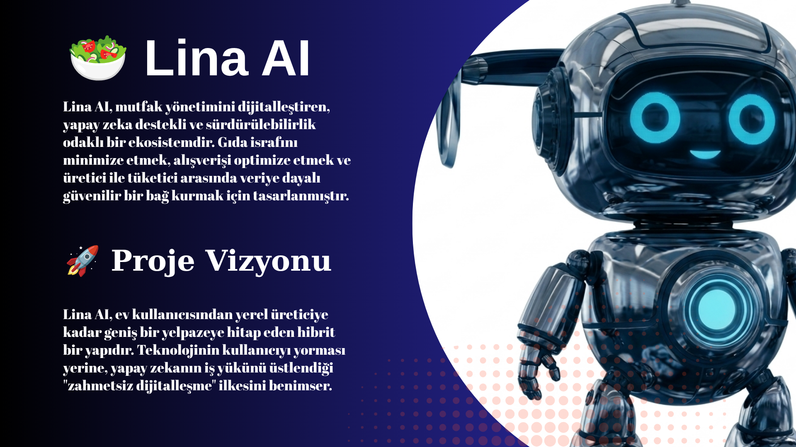

## Özet
Gıda israfını önleyen
"Dijital Buzdolabı
"
ve çok modlu (multimodal) AI asistanı ile donatılmış hibrit bir ekosistemdir. Rol bazlı
yönlendirme mimarisiyle; kullanıcıya görselden otomatik malzeme/tarif analizi, kişiselleştirilmiş diyet/alerjen filtreleme ve
doğrudan sipariş imkânı sunarken, satıcıya veri odaklı yönetim paneli sağlar. IndexedStack mimarisi, güvenli Firestore altyapısı ve
gelişmiş AI entegrasyonları ile uçtan uca ölçeklenebilir ve dayanıklı bir sistem olarak geliştirilmiştir.

## Öne Çıkanlar
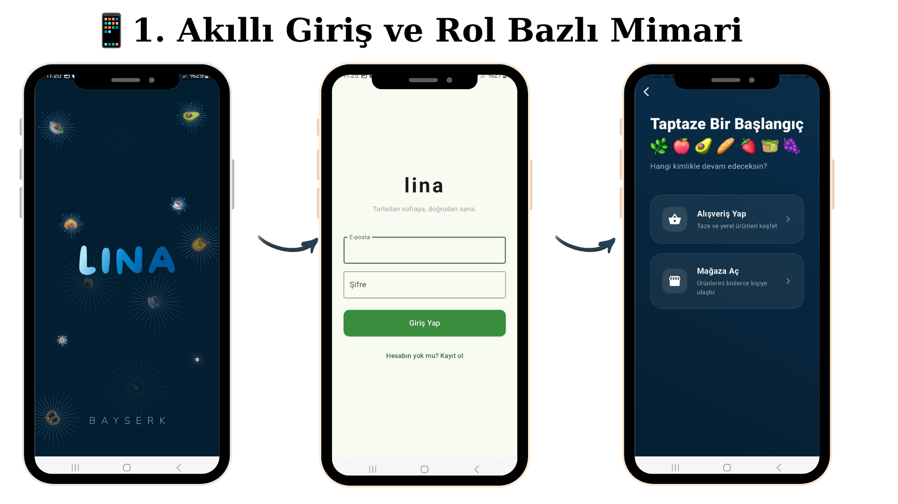
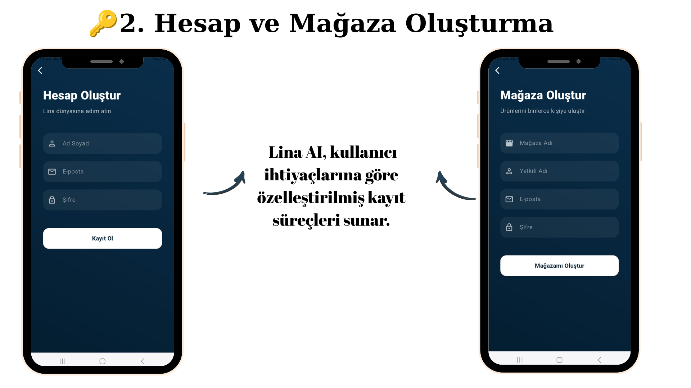

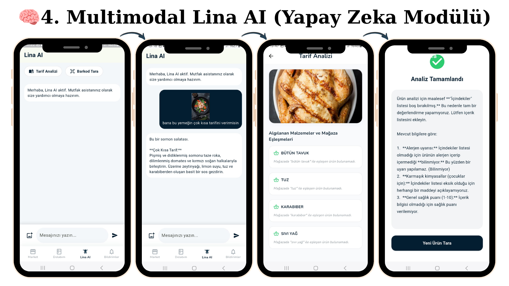
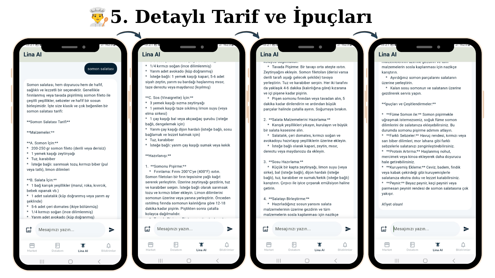
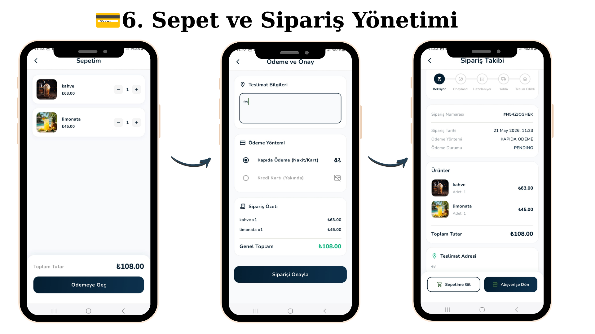
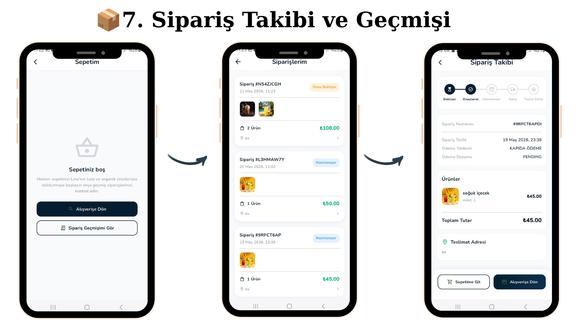
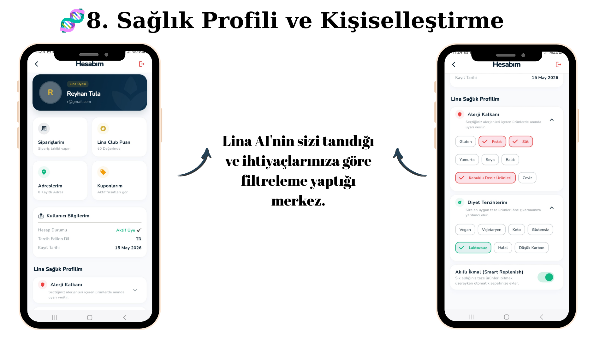
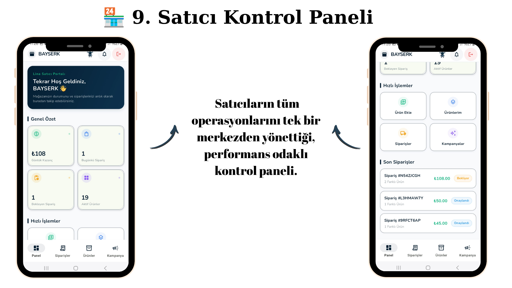
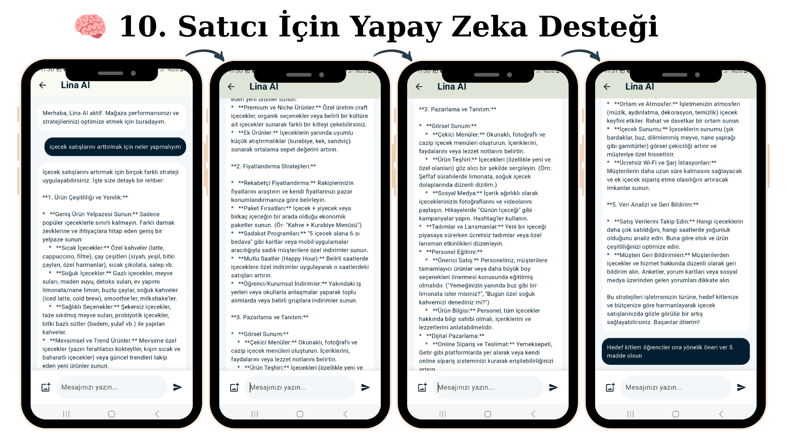
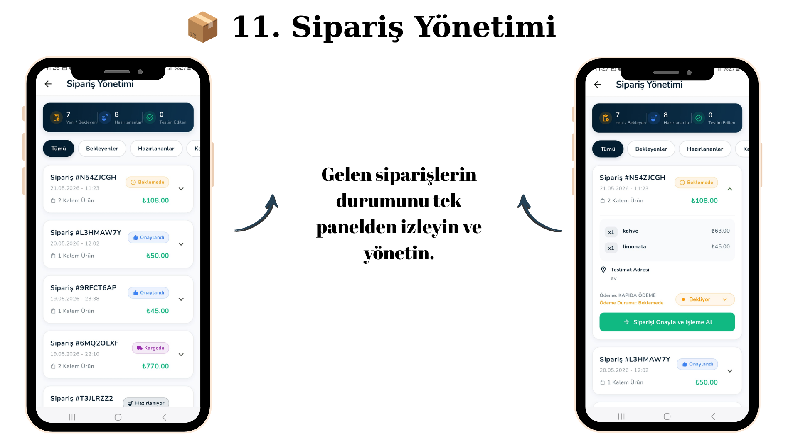
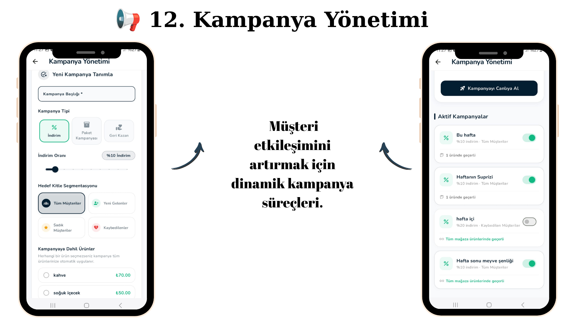
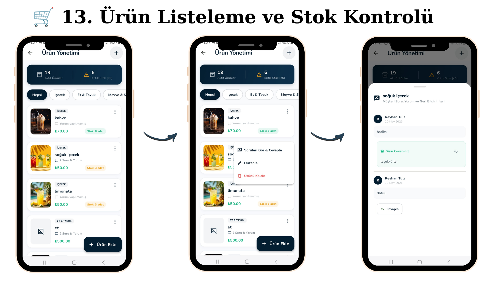
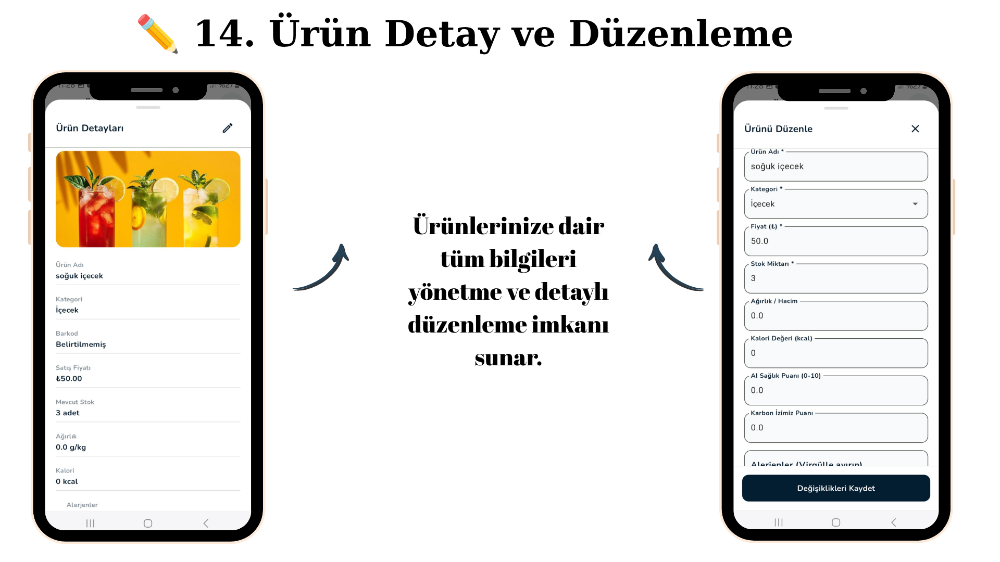
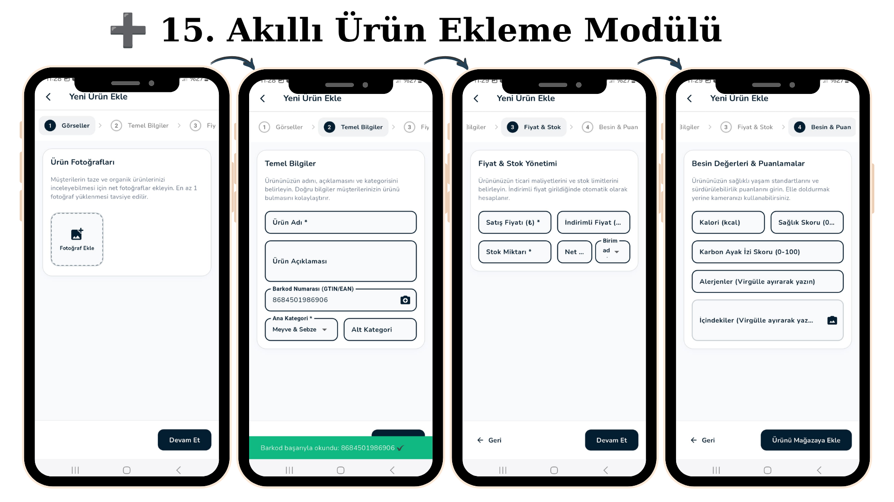
